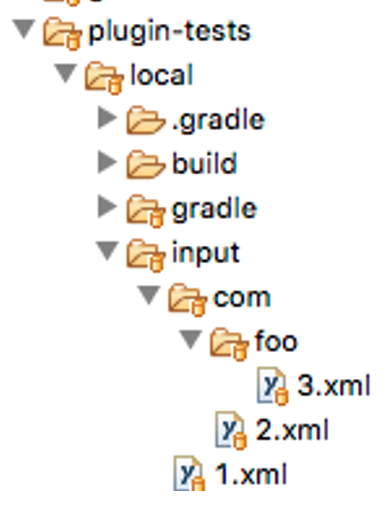
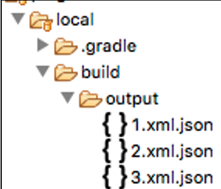
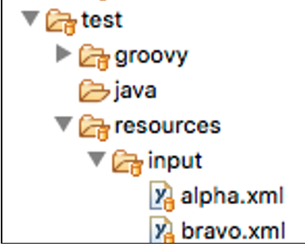

## 4.7 Files, Files, and Files

A common need in Gradle plugins is to interact with the file system. Directory navigation, direction creation, file creation, and file parsing are some of those common file system operations. The challenge with A Gradle plugin and its interaction with the file system, starts with how one does unit testing. 

Unit testing is challenging because some of the underlying file system classes are unable to be mocked, as they are final in Java. While other classes can be mocked, doing so can involving complicated mocking code, as file system classes tend to be changed together. A calls B, B returns C, C returns D and so on. The purpose of this plugin is to demonstrate how a Gradle plugin interacts with the file system, by converting all XML files recursively in a directory to JSON. This demonstration includes the strategies for unit testing the various file system operations.

#### Example Input

```xml
<alpha>
    <a>1</a>
	<b>2</b>
	<bravo>
	    <c>3</c>
		<d>4</d>
		<e>
			<charlie>
				<f>5</f>
			</charlie>
		</e>
	</bravo>
</alpha>

```

The example input is a generic XML document, that uses objects in objects, with numerical values at each level.

 

#### Example Output

```json
{
	"a": "1",
	"b": "2",
	"bravo": {
		"c": "3",
		"d": "4",
		"e": {
			"charlie": {
				"f": "5"
			}
		}
	}
}

```

The example output is the JSON equivalent of the XML Input.

#### src/main/groovy/com/blogspot/jvalenitno/gradle/XmlToJsonTask.groovy

```groovy
class XmlToJsonTask extends DefaultTask {

    protected XmlToJsonTask instance = this
    protected String input = 'input'

    @TaskAction
    void perform() {
        Project p = instance.project

        String output = "${p.buildDir.absolutePath}/output"
        File outputDir = new File(output)
        outputDir.mkdirs()

        FileTree tree = p.fileTree(input) { include '**/*.xml' }

        tree.files.each { File file ->

            GPathResult xml = new XmlSlurper().parseText(file.text)
            Map map = convertToMap(xml)

            JsonBuilder builder = new JsonBuilder(map)

            String json = "${outputDir.absolutePath}/${file.name}.json"
            File jsonFile = new File(json)
            jsonFile.text = builder.toString()

            println "- ${file.name} was converted to ${jsonFile.name}"
        }
    }

    Map convertToMap(GPathResult nodes) {
        nodes.children().collectEntries {
            [
                it.name(),
                it.childNodes() ? convertToMap(it) : it.text(),
            ]
        }
    }
}

```

The purpose of this task is to find all files with an .xml extension in any directory starting in the “input” directory, relative to where the Gradle build is located. For each of the located XML files, a method is called to convert the XML to a general Map, which can then be converted to JSON using Groovy’s **JsonBuiilder** class. Note that this XML to Map method only handles Map structures, not list structures, so don’t expect this to work with every conceivable XML document.

 

**Line 23: Project**

Since the **project** object will be used in several places within the method, it was put in a local variable for both convenience, and via the **instance** member variable so that it can later be mocked in unit testing.

 

**Lines 25-27: The output directory**

Since this is a custom Gradle plugin that does not depend on any other plugin, the “build” directory will not be created for you. This requires that both it and the directory intended to be used for the JSON file output to be created.

 

**Lines 29-31: FileTree iteration**

**FileTree** iteration can be done using **FileTree.eachFile**, however this is not recommended for testing purposes. The reach is that **FileTree.eachFile** cannot be easily mocked, while **FileTree.files** can be mocked, permitting the driving of **eachFile**.

 

**Lines 33-42: XML to JSON conversion**

Uses Groovy’s built in XML and JSON capabilities to convert each XML file into a corresponding JSON file in the output directory.

 

**Lines 46-53: XML to JSON logic**

General logic for converting XML to JSON, noting that it only works for Map structures. If there is an XML list, it won’t work.

 

##### plugin-tests/local/build.gradle

```groovy
buildscript {
  repositories {
	jcenter()
  }
  dependencies {
    classpath 'com.blogspot.jvalentino.gradle:files-demo:1.0.0'
  }
}

apply plugin: 'files-demo'


```

To use the plugin for manual testing purposes, the classpath dependency and plugin application only need to occur, since **settings.gradle** is used to depend on the parent plugin containing project.

 

#### Testing Directory Structure



The input directory was setup with three XML files in different child directories. This was done to ensure that the **FileTree** expression works recursively.

 

#### Manual Testing

```bash
plugin-tests/local$ gradlew xmlToJson

> Task :xmlToJson 
- 1.xml was converted to 1.xml.json
- 2.xml was converted to 2.xml.json
- 3.xml was converted to 3.xml.json


BUILD SUCCESSFUL

```

The execution of the task will result in the three XML files from the input directory being converted to JSON in the output directory:



#### src/test/groovy/com/blogspot/jvalentino/gradle/XmlToJsonTaskTestSpec.groovy

The first consideration in the unit testing strategy is whether to completely rely on mocks, or direct mocks to use the file system. A general rule is that if the method in question uses a closure, it is best to drive it using the actual file system. This is because closures in Groovy can be problematic to test, and when specifically involving the file system rely on numerous layers of enhanced and injected classes. This makes mocking requires a lot of debug-based inspection to figure out what and how to mock.

Since the two methods in class make heavy usage of closures, specifically for **FileTree** inclusion, **FileTree** iteration, and XML node iteration, the best strategy is to drive using the file system. The recommended location for testing files is within src/test/resources, as it is a part of the codebase, but not something which will end up in any Jar deliverables. In preparation for testing XML to JSON conversion, two XML files have been places in this directory:



The intention is to when unit testing the **perform** method that handles finding XML files and converting them to JSON, to set the input to be the location of src/test/resources/input.

```groovy
class XmlToJsonTaskTestSpec extends Specification {

    @Subject
    XmlToJsonTask task
    Project project
    
    def setup() {
        Project p = ProjectBuilder.builder().build()
        task = p.task('ping', type:XmlToJsonTask)
        task.instance = Mock(XmlToJsonTask)
        project = Mock(ProjectInternal)
        
        FileUtils.deleteDirectory(
            new File("build/testcase/output"))
    }
    
    def cleanup() {
        FileUtils.deleteDirectory(
            new File("build/testcase/output"))
    }

```

 

**Lines 14-16: Standard members**

The subject of the test, being the class under test, and the Gradle project instance will be needed in every method.

 

**Lines 19-22: Standard setup**

The **ProjectBuilder** must be used to instantiate the Task, and we will be relying on a Mock Project instance and a Mock self-reference for testing.

 

**Lines 24-25: On setup, keep it clean**

Since this test will be writing to the file system, we need to ensure that that location does not exist when the test runs. If you were not to handle the cleaning prior to each test run, there is potential for tests to interfere within one another, and for a test go be reliant on something that was only once put on the file system. These types of dependencies are usually found when a test passes locally but fails on the central build server.

 

**Lines 28-31: On cleanup, keep it clean**

It is possible for a test to fail prior to the setup method being executed due to class level failures, so it is best to delete potential output after a test is run as well.

```groovy
    void "test perform"() {
        given:
        task.input = 'src/test/resources/input'
        File buildDir = Mock(File)
        ConfigurableFileTree fileTree = Mock(ConfigurableFileTree)
        fileTree.files >> [
            new File('src/test/resources/input/alpha.xml'),
            new File('src/test/resources/input/bravo.xml')
        ]
        
        when:
        task.perform()
        
        then:
        1 * task.instance.project >> project
        1 * project.buildDir >> buildDir
        1 * buildDir.absolutePath >> 'build/testcase'
        
        and:
        1 * project.fileTree(task.input, _) >> fileTree 
        new File("build/testcase/output/alpha.xml.json").text == 
            '{"b":"1"}'
        new File("build/testcase/output/bravo.xml.json").text == 
            '{"b":"2"}'
        
    }

```

**Line 35: Test file system redirection**

The task uses the **input** member variable to designate the location on the file system, relative to the running build, to specify the location of XML files. Unit tests execute relative to the root of the containing project, so this location can be changed to the location under src/test/resources where we earlier put our XML test files.

 

**Line 36: Mocking buildDir**

In Gradle, **project.builderDir** is used to refer to the build directory on the file system. By default, this is “build” relative to build.gradle. In the method under test the **buildDir** variable is used to derive output location via **absolutePath**, so only this method needs to have a mocked return.

 

**Lines 37-41: Mocking a FileTree**

A **ConfigurableFileTree** allows the specific access to the **files** method, which returns the list of files that are used for iteration in a general **FileTree**. This mocking specifies to return our two test XML files when asked for the iterator.

 

**Line 44: perform**

Invokes the method under test.

 

**Line 47: Project mocking**

Handles substituting the task’s **project** instance with our mock, so we can directly drive its interactions.

 

**Lines 48-49: Mocking buildDir**

The mock of the **buildDir** is returned, so that is location can be redirected to a location under the project **build** directory that we are expecting. This deleting (cleanup) of this location is handles in the test class setup and tear down methods.

 

**Line 52: FileTree mock return**

The mock **FileTree**, is returned, which contains our two test XML files.

 

**Lines 53-56: Asserting the result**

The expected result is for our test XML files to be converted to JSON and placed in the output directory, which was specified using the mocked **buildDir**. The content of those files are asserted against their expected JSON representations.


